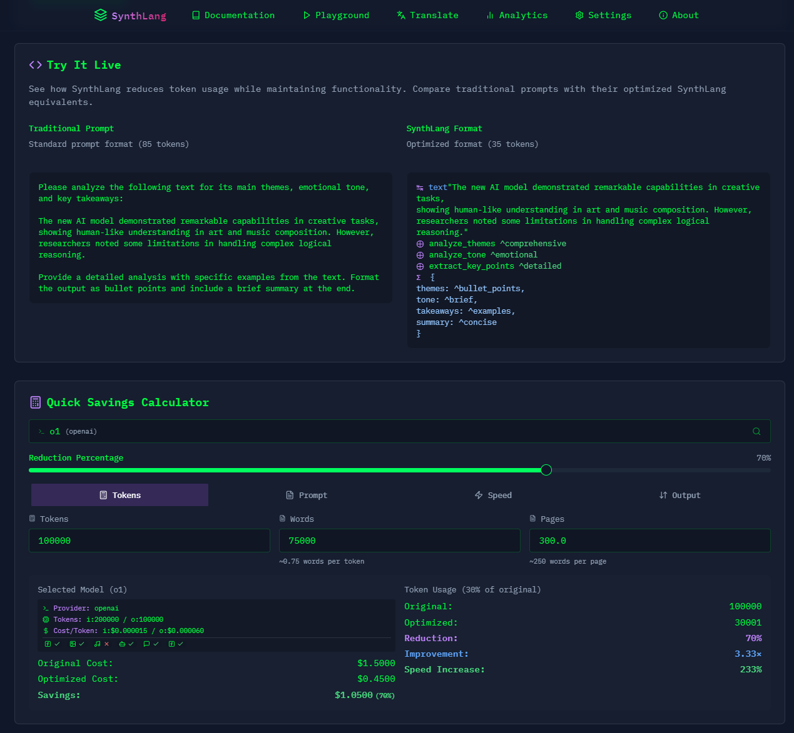

# Symbolic Scribe

[](https://github.com/ruvnet/SynthLang)
[](https://synthlang.fly.dev/)



# Optimize Your AI Prompts
Reduce AI costs by up to 70% with SynthLang's efficient prompt optimization. Experience up to 233% faster processing while maintaining effectiveness.

Transform your AI interactions with mathematically-structured prompts. Symbolic Scribe brings academic rigor to prompt engineering, helping you create more precise, reliable, and powerful AI interactions.

## Technical Details

### Core Components

🔄 **Translator Engine**
- Advanced prompt parsing and tokenization
- Intelligent structure analysis and context identification
- Pattern recognition and syntax transformation
- Real-time format validation and error detection
- Metadata extraction and processing

⚡️ **Performance Optimization**
- Token reduction up to 70% through advanced compression
- Processing speed improvements up to 233%
- Real-time token counting and model-specific calculations
- Semantic analysis and duplicate detection
- Context merging and density optimization

🧪 **Testing Framework**
- Comprehensive OpenRouter integration
- Response quality validation
- Performance monitoring (<500ms translation time)
- Success rate tracking and error management
- Usage pattern analysis

🔧 **Technical Architecture**
- React + TypeScript frontend with Vite
- Tailwind CSS for responsive design
- OpenRouter API integration
- Local-first architecture for privacy
- WebAssembly modules for performance
- Horizontal scaling capability
- Advanced caching strategies

### Performance Specifications

🎯 **System Requirements**
- Response time < 500ms for translations
- 99.9% uptime for API services
- < 100ms latency for token counting
- Real-time cost calculation
- Concurrent request handling
- Load balancing and request queuing

🔒 **Security Features**
- Encrypted API key storage
- Request validation and access control
- Comprehensive audit logging
- Data encryption at rest and in transit
- Automated security testing

✨ **Mathematical Precision** - Use formal frameworks for structured prompts  
🧮 **Academic Rigor** - Leverage set theory, topology, and abstract algebra  
🔒 **Enhanced Security** - Built-in threat modeling and safety constraints  
📱 **Modern Interface** - Sleek, responsive design that works everywhere  
🚀 **Instant Testing** - Real-time preview with multiple AI models  

## Key Features & Benefits

### Mathematical Framework Integration
- **Set Theory Templates**: Model complex relationships and hierarchies
- **Category Theory**: Define abstract transformations and mappings
- **Abstract Algebra**: Structure group operations and symmetries
- **Topology**: Explore continuous transformations and invariants
- **Complex Analysis**: Handle multi-dimensional relationships

### Practical Applications
- **Information Security**: Model threat vectors and attack surfaces
- **Ethical Analysis**: Structure moral frameworks and constraints
- **AI Safety**: Define system boundaries and safety properties
- **Domain Adaptation**: Apply mathematical rigor to any field

### User Experience
- **Interactive Console**: Terminal-style interface with modern aesthetics
- **Real-time Preview**: Test prompts with multiple AI models
- **Template Library**: Pre-built frameworks for common use cases
- **Mobile Responsive**: Full functionality on all device sizes
- **Local Storage**: Secure saving of prompts and preferences

## Security Features

### API Key Management
- Encrypted local storage of API keys
- Optional environment variable configuration
- No server-side key storage
- Automatic key validation

### Data Privacy
- Client-side only processing
- No external data transmission except to OpenRouter API
- No tracking or analytics
- Configurable model selection

## Quick Start

1. **Installation**
```bash
git clone https://github.com/ruvnet/SynthLang.git
cd SynthLang
npm install
```

2. **Configuration**
```bash
cp .env.sample .env
# Edit .env with your OpenRouter API key
```

3. **Development**
```bash
npm run dev
```

4. **Production Build**
```bash
npm run build
npm run preview
```

## CLI Tool

SynthLang includes a powerful command-line interface for prompt engineering, framework translation, and optimization capabilities.

### CLI Installation

```bash
pip install synthlang
```

### Basic Commands

1. **Translate** - Convert natural language to SynthLang format:
```bash
synthlang translate --source "your prompt" --framework synthlang
```

2. **Optimize** - Improve prompt efficiency:
```bash
synthlang optimize "path/to/prompt.txt"
```

3. **Evolve** - Use genetic algorithms to improve prompts:
```bash
synthlang evolve "initial_prompt"
```

4. **Classify** - Analyze and categorize prompts:
```bash
synthlang classify "prompt_text"
```

For detailed documentation on CLI usage and features, see:
- [Usage Guide](cli/docs/usage.md)
- [Development Guide](cli/docs/development.md)
- [Classification System](cli/docs/classification.md)
- [Evolution System](cli/docs/evolution.md)

## Usage Guide

### Basic Prompt Generation
1. Select a mathematical framework template
2. Choose your target domain
3. Define your variables and relationships
4. Generate structured prompts

### Template Customization
1. Navigate to Templates page
2. Select a base template
3. Modify variables and relationships
4. Save for future use

### Testing & Iteration
1. Use the Preview function to test prompts
2. Select different models for comparison
3. Refine based on responses
4. Export final versions

## InfoSec Overview

### Threat Model
- Client-side only architecture
- No persistent server storage
- Encrypted API key storage
- Input sanitization

### Best Practices
- Regular API key rotation
- Use environment variables in production
- Monitor API usage
- Review generated prompts for sensitive data

## Contributing

We welcome contributions! Please see our [Contributing Guide](CONTRIBUTING.md) for details.

### Development Setup
1. Fork the repository
2. Create a feature branch
3. Install dependencies
4. Make your changes
5. Run tests
6. Submit a PR

## Support

- Documentation: `/docs` page in app
- Issues: GitHub issue tracker
- Community: Discord server (coming soon)

## System Architecture

```
src/
├── core/
│   ├── translator/        # Prompt translation engine
│   ├── optimizer/        # Token optimization system
│   └── tester/          # Testing framework
├── services/
│   ├── openRouter/      # OpenRouter integration
│   ├── storage/         # State management
│   └── analytics/       # Performance metrics
└── interfaces/
    ├── web/            # Web interface
    └── api/            # API endpoints
```

### Development Guidelines

🔨 **Code Organization**
- Modular architecture with clear separation of concerns
- Consistent naming conventions and comprehensive documentation
- Type safety and robust error handling
- Extensive test coverage (unit, integration, performance)
- CI/CD pipeline with automated testing and deployment
- Comprehensive monitoring and logging

### Future Roadmap

🚀 **Planned Enhancements**
- Advanced optimization algorithms
- Extended model support
- Enhanced analytics capabilities
- Automated optimization suggestions
- Custom testing scenarios
- Batch processing improvements
- Community features and integrations

## License

MIT License - see LICENSE file for details

## Acknowledgments

- OpenRouter for AI model access
- shadcn/ui for component library
- Tailwind CSS for styling
- Vite for build tooling
